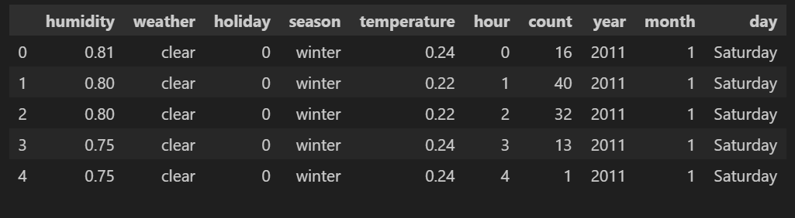
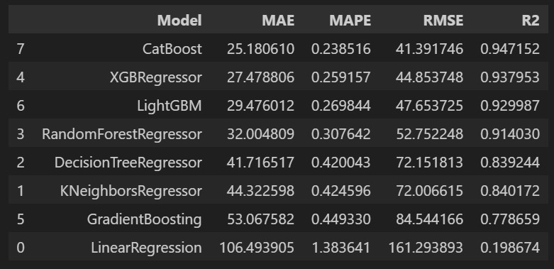
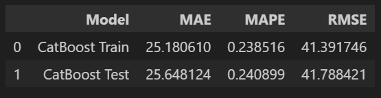
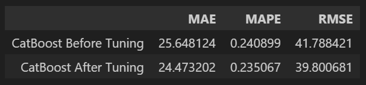
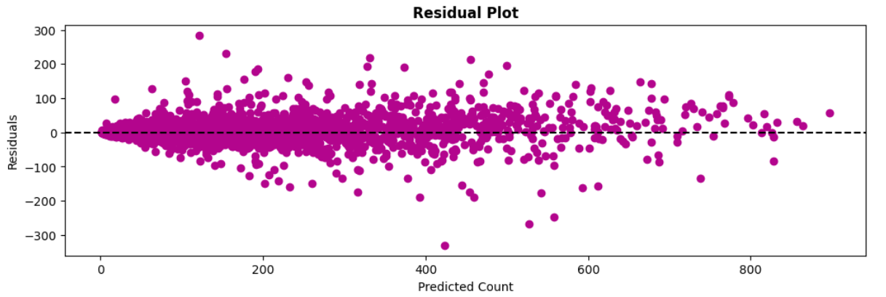
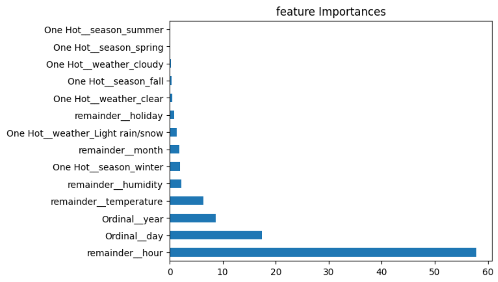

Capital BikeShare Bike Demand Prediction

# Background
Sistem bike sharing merupakan terobosan baru dari model penyewaan sepeda tradisional di mana seluruh proses mulai dari keanggotaan,pembayaran, penyewaan serta pengembalian kembali telah di-otomatisasi. Melalui sistem bike sharing ini, pengguna dapat dengan mudah menyewa sepeda dari lokasi tertentu dan mengembalikannya kembali di lokasi yang lain. Saat ini, terdapat lebih dari 500 program bike sharing di seluruh dunia yang terdiri dari lebih dari 500 ribu sepeda. Saat ini, terdapat minat yang besar terhadap sistem ini karena peran pentingnya dalam lalu lintas, biaya transportasi serta masalah lingkungan dan kesehatan. 

Menariknya sistem bike sharing ini pada penerapanya di dunia nyata, membuat pemerintah Washington memutuskan untuk terjun kedalam bisnis bike sharing di wilayah mereka dengan nama Capital Bikeshare, Capital Bikeshare dimiliki oleh pemerintah daerah dan dioperasikan oleh operator swasta Alta Bike Share, dimana Alta Bike Share yang menerima kontrak untuk menjalakan operasi Capital Bikeshare dengan Biaya perencanaan dan implementasi untuk sistem baru ini mencapai 5 juta dollar.

# Problems
Tentunya banyak tantangan yang muncul dalam bisnis transportasi berbasis sepeda ini, apalagi bagi Capital Bikeshare yang notabene sebagai pemain baru yang terjun kedalam bisnis ini, salah satunya adalah capital bikeshare harus mampu untuk menyediakan jumlah unit sepeda yang tepat di setiap kondisi dan situasi. Karena jika tidak mampu menyediakan sepeda dengan jumlah yang tepat, maka bisa terjadi kegagalan dalam memenuhi tuntutan dari pelanggan yang bisa berakibat hilangnya kepercayaan pelanggan. Namun apabila jumlah ketersediaan sepeda terlalu banyak, hal itu bisa menyebabkan banyaknya unit sepeda yang tidak terpakai, atau kurang efisien. Dimana hal tersebut bisa berdampak pada biaya operasional yang mencakup biaya manajemen, logistik, serta perawatan untuk tiap unit sepeda.

# Goals
---
Dari masalah diatas, Capital Bikeshare perlu memiliki alat yang berguna untuk memprediksi serta membantu tiap stakeholder yang terkait (divisi operasi maupun Capital Bikeshare itu sendiri) untuk dapat menentukan jumlah unit sepeda yang perlu disediakan dengan tepat di setiap situasi dan kondisi. Adanya perbedaan musim, cuaca, kelembaban dan suhu dapat menambah tingkat akurasi prediksi jumlah unit sepeda yang perlu disediakan. Dimana hal tersebut dapat menjaga efisiensi operational cost dari sisi Capital Bikeshare dan efisiensi kerja dari divisi operasi.

Stakeholders:
* Capital bike share executive teams: untuk melakukan persetujuan project dan strategi optimalisasi biaya operasi.  
* Operation division: efisiensi kerja departemen operasi (menyiapkan sepeda dalam jumlah tertentu, tidak semua).

# Approach
---
kita akan melakukan analisis terhadap dataset untuk menemukan pola dari feature yang tersedia, pembeda antara berbagai kondisi, serta bagaimana perilaku setiap feature dalam mempengaruhi jumlah unit sepeda yang perlu disediakan. Selanjutnya, kita akan membangun sebuah model regresi yang akan membantu dalam menentukan jumlah unit sepeda yang perlu disediakan oleh Capital Bikeshare.

# Metric Evaluation
---
Dalam mengevaluasi tingkat akurasi model, kami akan menggunakan tiga metrik: RMSE, MAE, dan MAPE. Metrik-metrik ini memberikan gambaran mengenai kinerja model regresi:

- RMSE (Root Mean Squared Error) menghitung akar kuadrat rata-rata dari kesalahan, yang memberikan ukuran deviasi keseluruhan antara nilai yang diprediksi dan nilai aktual.

- MAE (Mean Absolute Error) menghitung perbedaan absolut rata-rata antara nilai yang diprediksi dan nilai aktual, memberikan ukuran langsung dari keakuratan model.

- MAPE (Mean Absolute Percentage Error) menghitung perbedaan persentase rata-rata antara nilai yang diprediksi dan nilai aktual, yang memungkinkan kita untuk menilai besarnya kesalahan relatif.

Dengan melihat nilai RMSE, MAE, dan MAPE, kita dapat mengukur tingkat akurasi model dalam memprediksi jumlah unit sepeda dengan mempertimbangkan keterbatasan feature-feature yang digunakan. Nilai yang lebih rendah dari metrik-metrik ini mengindikasikan tingkat akurasi yang lebih tinggi dalam prediksi.

# Data Understanding
---
- Dataset merupakan data peminjaman sepeda di sistem *Capital Bikeshare* dalam rentang tahun 2011-2012.
- Setiap baris data merepresentasikan informasi terkait waktu peminjaman, cuaca, dan musim yang sesuai.

### Attribute Information

| Columns                                            | Definition                                                   | 
| ------------------------------------------------- | ------------------------------------------------------------ |
| dteday | date |
| hum | normalized humidity. The values are divided into 100 (max) |
| weathersit | 1: Clear, Few clouds, Partly cloudy, Partly cloudy  2: Mist + Cloudy, Mist + Broken clouds, Mist + Few clouds, Mist  3: Light Snow, Light Rain + Thunderstorm + Scattered clouds, Light Rain + Scattered clouds  4: Heavy Rain + Ice Pallets + Thunderstorm + Mist, Snow + Fog |
| holiday | 0: not holiday  1: holiday|
| season | 1: winter  2: spring  3: summer  4: fall |
| atemp | Normalized feeling temperature in Celsius. |
| temp | normalized temperature in Celsius. |
| hr | hour (0 to 23) |
| casual | count of casual users |
| registered | count of registered users |
| cnt | count of total rental bikes including both casual and registered |

# Data Preprocessing

Pada tahap ini, kita akan melakukan set-up atau cleaning pada data set agar data siap digunakan untuk analisis dan modelling. Beberapa hal yang perlu dilakukan adalah:

- Melakukan pengecekan missing value dan data duplikat.
- Melakukan penyesuaian beberapa nama kolom dan value untuk memudahkan keterbacaan data.
- Mengubah beberapa tipe data pada feature agar sesuai dengan nilai yang dimiliki.
- Melakukan penggabungan value dalam feature untuk keperla modelling.
- Drop feature yang tidak memiliki relevansi terhadap permasalahan yang sedang dihadapi.
- Mengecek korelasi antar data.
- Mengecek outlier pada data numerik.

# Clean dataset

# Benchmark model

# Basemodel Catboost

# Comparison after tuning

# Residual

# Feature importance

------------

    ├── README.md          <- The top-level README for developers using this project.
    ├── data               <- dataset used in project
    ├── notebooks          <- Jupyter notebooks. include models creation and the saved model.
    │
    │
    ├── requirements.txt   <- The requirements file for reproducing the analysis environment, e.g.
    │                         generated with `pip freeze > requirements.txt`
    │
    ├── src                <- Source code for use in this project.
    │   ├── __init__.py    <- Makes src a Python module
    │   │
    │   ├── data           <- Scripts to download or generate data
    │   │   └── make_dataset.py
    │   │
    │   ├── features       <- Scripts to turn raw data into features for modeling
    │   │   └── build_features.py
    │   │
    │   ├── models         <- Scripts to train models and then use trained models to make
    │   │   │                 predictions
    │   │   ├── predict_model.py
    │   │   └── train_model.py
    │   │
    │   └── visualization  <- Scripts to create exploratory and results-oriented visualizations
    │
    └── references         <- Data dictionaries, manuals, and all other explanatory materials.

--------
